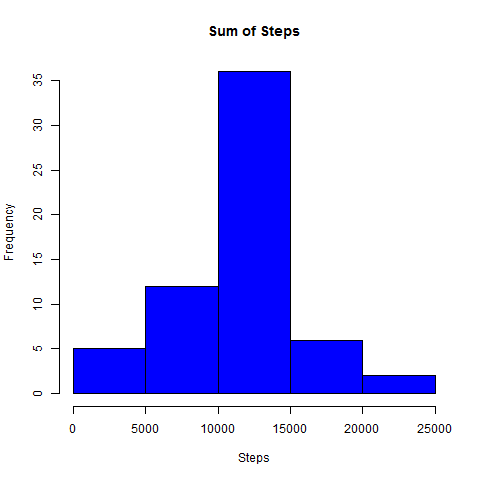

## Loading and preprocessing the data

###Loading required packages


```r
  library(dplyr)
```

```
## 
## Attaching package: 'dplyr'
## 
## The following object is masked from 'package:stats':
## 
##     filter
## 
## The following objects are masked from 'package:base':
## 
##     intersect, setdiff, setequal, union
```

```r
  library(ggplot2)
  library(lattice)
```
###Loading the data
  

```r
setwd("C:/Users/kennedyal/RepData_PeerAssessment1")
activity<- read.csv("activity.csv")
```
###Analysis of the data file

```r
str(activity)
```

```
## 'data.frame':	17568 obs. of  3 variables:
##  $ steps   : int  NA NA NA NA NA NA NA NA NA NA ...
##  $ date    : Factor w/ 61 levels "2012-10-01","2012-10-02",..: 1 1 1 1 1 1 1 1 1 1 ...
##  $ interval: int  0 5 10 15 20 25 30 35 40 45 ...
```

```r
#As we can see the date is a factor, but we will keep it as a factor for our analysis
summary(activity)
```

```
##      steps                date          interval     
##  Min.   :  0.00   2012-10-01:  288   Min.   :   0.0  
##  1st Qu.:  0.00   2012-10-02:  288   1st Qu.: 588.8  
##  Median :  0.00   2012-10-03:  288   Median :1177.5  
##  Mean   : 37.38   2012-10-04:  288   Mean   :1177.5  
##  3rd Qu.: 12.00   2012-10-05:  288   3rd Qu.:1766.2  
##  Max.   :806.00   2012-10-06:  288   Max.   :2355.0  
##  NA's   :2304     (Other)   :15840
```

```r
#there are 2304 NA steps
```

## What is mean total number of steps taken per day?

###total number of steps per day

```r
day<- group_by(activity, date)
summary <-summarize(day, sum_steps = sum(steps, na.rm = TRUE))
summary
```

```
## Source: local data frame [61 x 2]
## 
##          date sum_steps
## 1  2012-10-01         0
## 2  2012-10-02       126
## 3  2012-10-03     11352
## 4  2012-10-04     12116
## 5  2012-10-05     13294
## 6  2012-10-06     15420
## 7  2012-10-07     11015
## 8  2012-10-08         0
## 9  2012-10-09     12811
## 10 2012-10-10      9900
## ..        ...       ...
```
###Histogram of total number of steps each day


```r
hist(summary$sum_steps, col = "blue", xlab = "Steps", main = "Sum of Steps")
```

 

###Mean of total number of steps each day

```r
mean(summary$sum_steps)
```

```
## [1] 9354.23
```

###Median of total number of steps each day

```r
median(summary$sum_steps)
```

```
## [1] 10395
```

```r
## What is the average daily activity pattern?
##What is the average daily activity pattern?

###Make a time series plot (i.e. type = "l") of the 5-minute interval (x-axis) and the average number of steps taken, averaged across all days (y-axis)
```

```r
interval <- group_by(activity, interval)
interval_summary <-summarize(interval, avg_steps = mean(steps, na.rm = TRUE))
qplot(interval, avg_steps, data = interval_summary, geom = "line")
```

 
###Max 5 minute interval

```r
max<-which.max(interval_summary$avg_steps)
interval_summary[max,]
```

```
## Source: local data frame [1 x 2]
## 
##   interval avg_steps
## 1      835  206.1698
```

## Imputing missing values
##impute missing values

```r
activity_impute <-activity
for (i in 1:nrow(activity_impute))
{
  if (is.na(activity_impute$steps[i]))
  {
    int <- activity_impute$interval[i]
    row <- which(interval_summary$interval == int)
    steps <- interval_summary$avg_steps[row]
    activity_impute$steps[i] <- steps
  }
  
}
```
##creating new data set grouped by date for total number of steps each day and plot Histogram for it

```r
day_impute<- group_by(activity_impute, date)
summary_imputed <-summarize(day_impute, sum_steps = sum(steps, na.rm = TRUE))
hist(summary_imputed$sum_steps, col = "blue", xlab = "Steps", main = "Sum of Steps")
```

 
###Report mean and median for before imputing and after imputing

```r
mean(summary$sum_steps)
```

```
## [1] 9354.23
```

```r
median(summary$sum_steps)
```

```
## [1] 10395
```

```r
mean(summary_imputed$sum_steps)
```

```
## [1] 10766.19
```

```r
median(summary_imputed$sum_steps)
```

```
## [1] 10766.19
```

```r
##As we can see there is a slight change after the NA were imputed
```

## Are there differences in activity patterns between weekdays and weekends?

```r
activity_impute$date <- as.Date(activity_impute$date, "%Y-%m-%d")
activity_impute$day<- weekdays(activity_impute$date)
activity_impute <- mutate(activity_impute, weekend = factor(day %in% c("Saturday","Sunday"), labels = c("weekday","weekend")))
head(activity_impute)
```

```
##       steps       date interval    day weekend
## 1 1.7169811 2012-10-01        0 Monday weekday
## 2 0.3396226 2012-10-01        5 Monday weekday
## 3 0.1320755 2012-10-01       10 Monday weekday
## 4 0.1509434 2012-10-01       15 Monday weekday
## 5 0.0754717 2012-10-01       20 Monday weekday
## 6 2.0943396 2012-10-01       25 Monday weekday
```
###Time series plot

```r
week_agg <- aggregate(activity_impute$steps, by = list(activity_impute$interval, activity_impute$weekend),mean )
names(week_agg) <-c("interval","weekend","avg_steps")
xyplot(avg_steps ~ interval | weekend,data = week_agg,type = "l", layout = c(1,2), ylab = "Number of steps")
```

 
We can see a difference here. We can see that people or more active on the weekends.
